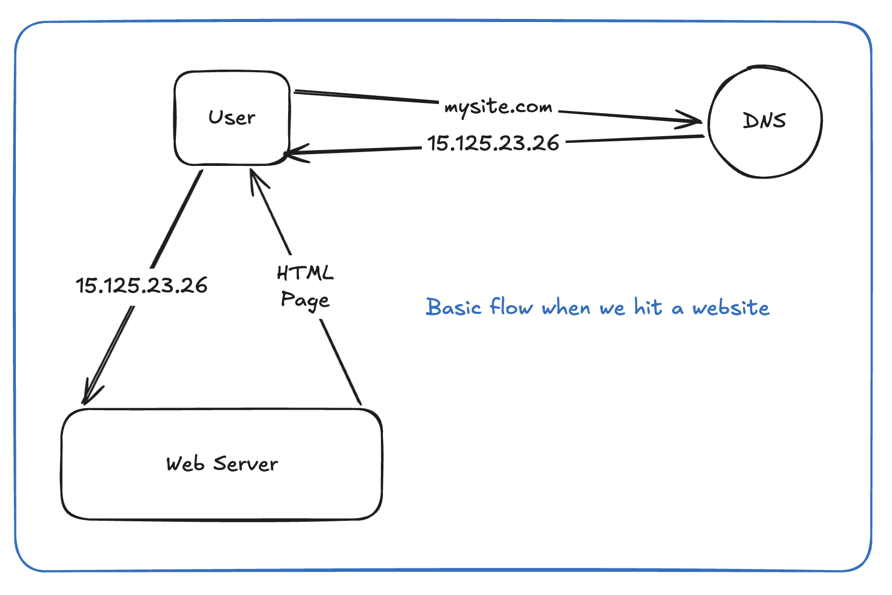

# Overview

**Scalability** = system's ability to handle growth (traffic, data, users) without redesign.

**Estimation (back-of-envelope)** = quick math to size the problem before designing — QPS, storage, bandwidth, servers.
Interviewers use estimation to check if you can reason with numbers, not vibes.

---

# Why Do We Need It?

- Without scalability thinking → system works at 10K users, dies at 10M.
- Without estimation → you design a distributed system for a problem that fits on one Postgres instance, or vice versa.
- Numbers drive design decisions: single DB vs sharded, cache vs no cache, sync vs async.
- Wrong scale assumption = wrong architecture = interview fail even if design is "correct" on paper.

---

# Mental Model ⭐⭐⭐⭐⭐

Think in 3 layers, always in this order:

Traffic (QPS) → Data (Storage) → Bandwidth (Network)
- Traffic → Servers needed, Load balancing, Caching
- Storage → DB sharding, Read replicas
- Bandwidth → CDN / compression, Regional deployment

Rule: **estimate once → design → don't re-estimate every sub-component**. One good estimation pass at the start is enough to steer major decisions (DB scale, need for cache, need for queue).

---

# Core Concepts

**Scalability types**
- Vertical (scale-up): bigger machine. Simple, ceiling exists, single point of failure.
- Horizontal (scale-out): more machines. Default for L5+ interviews, needs statelessness + partitioning.

**Read-heavy vs Write-heavy**
- Read-heavy (Twitter feed, YouTube) → cache aggressively, read replicas.
- Write-heavy (metrics, logging, IoT) → batch writes, queue, LSM-tree DBs, sharding by write key.

**Numbers to memorize (powers of 2 / latency)**
(TODO: Can be improved, add 2 ki power to visualize)

| Quantity | Value |
|---|---|
| 1 day | ~86,400 sec (~10^5) |
| 1 month | ~2.6M sec |
| 1 KB char | 1 byte (ASCII) |
| L1 cache ref | ~1 ns |
| RAM access | ~100 ns |
| SSD random read | ~100 μs |
| Round trip in same DC | ~0.5 ms |
| Round trip CA→Netherlands | ~150 ms |
| Disk seek | ~10 ms |

**Estimation flow (memorize this order):**
1. DAU/MAU → requests per user/day → QPS (avg + peak, peak = 2-3x avg usually)
2. Read:Write ratio (e.g. 100:1 for Twitter timeline)
3. Storage per record × records/day × retention = total storage
4. Bandwidth = QPS × avg payload size
5. Servers = peak QPS / QPS-per-server capacity

---

# Key Terminology

- **QPS** – Queries per second.
- **Peak QPS** – usually 2–3x average, sometimes higher for viral/spiky systems.
- **Fan-out** – one write triggering many reads/writes (e.g., push model for feeds).
- **P99 latency** – 99th percentile, not average — interviewers care about tail latency.
- **Vertical/Horizontal partitioning** – splitting by columns vs rows.
- **Hot partition/hot key** – uneven load on one shard/key, classic scaling failure.
- **Elasticity** – auto scale up/down with load (cloud-native scalability).

---

# Design Tradeoffs ⭐⭐⭐⭐⭐

**Vertical vs Horizontal Scaling**

| | Vertical | Horizontal |
|---|---|---|
| Advantage | No code change, simple | No ceiling, fault tolerant |
| Disadvantage | Hardware ceiling, single point of failure | Needs statelessness, coordination complexity |
| Use when | Early stage, simple systems, tight deadline | Expected to scale beyond one machine's limits |
| Avoid when | You already know scale will be massive | Team lacks distributed systems maturity (ops overhead) |

**Precise estimation vs rough estimation**
- Precise: good for capacity planning, cost estimates in production.
- Rough (order of magnitude): what interviews want — shows you can reason fast under ambiguity.
- WHY: interviewer isn't grading exact numbers, they're grading whether your architecture decisions follow from the numbers (e.g., "1M QPS → definitely need sharding + cache", not "let's compute exact server count").

**Over-engineering vs right-sizing**
- Advantage of over-engineering: future-proof.
- Disadvantage: wasted complexity, harder to reason about, more failure modes.
- L5 signal: right-size for stated scale, mention how you'd evolve if scale grows 10x/100x — don't build Google-scale system for a 10K user app.

---

# Production Examples

- **Twitter/X**: read:write ~1000:1 for timeline reads vs tweets — drives fan-out-on-write (push) for most users, fan-out-on-read (pull) for celebrities with huge follower counts (hybrid model to avoid hot-write problem).
- **YouTube**: storage estimation dominates design — video storage >> metadata storage, so architecture splits blob storage (S3-like) from metadata DB (Bigtable/Spanner-like) early.
- **WhatsApp**: message QPS estimation historically showed billions of messages/day but tiny payload size (few hundred bytes/text msg) → optimized for connection count (concurrent open sockets) not bandwidth.
- **Uber**: geo-sharding by city/region — estimation showed traffic is naturally partitioned by geography, so scale horizontally along that axis instead of a single global write path.

---

# Google Interview Discussion

**What they're evaluating:**
- Can you convert a vague prompt ("design X") into concrete numbers fast, without freezing?
- Do your architecture choices trace back to the numbers, or are they generic?
- Do you know when estimation *doesn't* matter (don't over-index on precision)?

**How a Senior Engineer should think:**
- Spend 3–5 min max on estimation, out loud, rounding aggressively (10^6, 10^9 not exact digits).
- State assumptions explicitly ("assume 500M MAU, 10% DAU ratio...") — interviewer will course-correct if wrong, that's fine.
- Immediately connect numbers to decisions: "at 50K QPS read-heavy, single DB won't survive → need read replicas + cache layer."

**Typical follow-ups:**
- "What if traffic is 10x this?" → tests if your design degrades gracefully or needs full rewrite.
- "What's your bottleneck at this scale?" → tests if you identify CPU vs I/O vs network bound correctly.
- "How would you estimate storage growth over 5 years?" → tests long-term thinking, retention policy awareness.

**Good discussion points:**
- Mention peak vs average QPS distinction unprompted.
- Mention hot-key/hot-partition risk before being asked.
- Explicitly state what you're NOT optimizing for at this scale (e.g., "at 1000 QPS we don't need Kafka, a queue would be overkill").

---

# Common Mistakes

- Doing estimation with excessive precision (calculator-level accuracy) — wastes interview time, signals junior thinking.
- Estimating and then never referencing the numbers again in the design.
- Forgetting peak vs average QPS (design breaks at launch/viral moment).
- Ignoring storage growth over time (only estimating day-1 state).
- Jumping to "we need Kafka/sharding/microservices" without justifying via numbers first — sounds like buzzword-driven design, big red flag at L5+.
- Not stating assumptions out loud (DAU, payload size, retention) — makes the whole estimation unverifiable/random-sounding.

---

# Connections

- **Caching**: estimation of read:write ratio directly determines whether caching is even needed.
- **Sharding**: storage/QPS estimation determines shard count and shard key strategy.
- **Load Balancer**: peak QPS ÷ per-server capacity = number of servers behind LB.
- **CAP**: scale decisions (multi-region, replicas) force CAP tradeoffs — estimation tells you *if* you need multi-region at all.
- **Database**: write-heavy vs read-heavy estimation drives DB choice (LSM-tree/write-optimized vs B-tree/read-optimized).
- **Networking**: bandwidth estimation (QPS × payload) determines CDN/compression need.

---

# One Minute Revision

- Estimation order: Traffic (QPS) → Storage → Bandwidth → Servers.
- Always separate peak QPS (2-3x avg) from average QPS.
- Round aggressively — order of magnitude, not precision.
- State assumptions out loud, connect every number to a design decision.
- Vertical scaling = simple but capped; horizontal = default for L5, needs statelessness.
- Read-heavy → cache + replicas; write-heavy → queue + write-optimized DB + sharding.
- Watch for hot keys/hot partitions — uneven load kills horizontal scaling.
- Don't over-engineer for scale you don't have; mention evolution path instead.

---

# Flash Cards

Q: What's the standard order for back-of-envelope estimation? \
A: Traffic (QPS) → Storage → Bandwidth → Server count.

Q: How much higher is peak QPS than average typically?\
A: 2–3x, more for viral/spiky systems.

Q: Vertical vs horizontal scaling — which needs statelessness?\
A: Horizontal — servers must be interchangeable/stateless to add more freely.

Q: What's a hot partition and why is it dangerous?\
A: A shard/key receiving disproportionate traffic — breaks horizontal scaling by creating a bottleneck despite having many nodes.

Q: Why do interviewers want rounded numbers, not precise ones?\
A: They're testing reasoning speed and design linkage, not arithmetic accuracy.

Q: Read:write ratio for Twitter-like feed systems?\
A: ~100:1 to 1000:1 read-heavy — drives fan-out-on-write for most users.

Q: When should you avoid horizontal scaling?\
A: When team/system lacks distributed coordination maturity, or scale doesn't justify the operational complexity.

Q: What single question tests if your design accounts for growth?\
A: "What happens if traffic is 10x this?"

