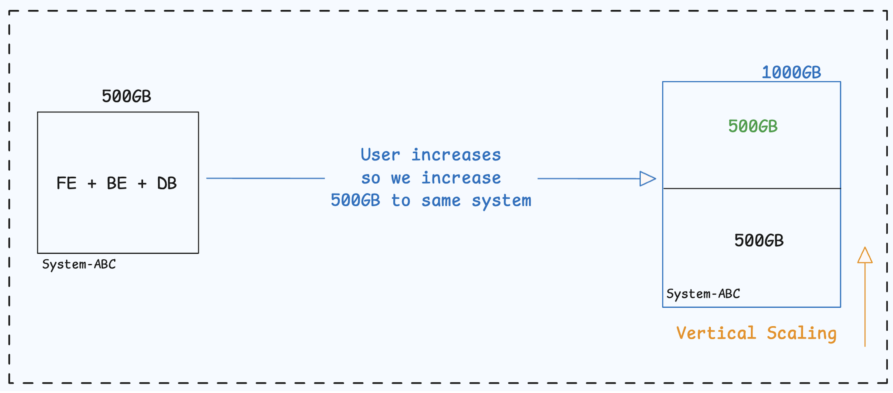
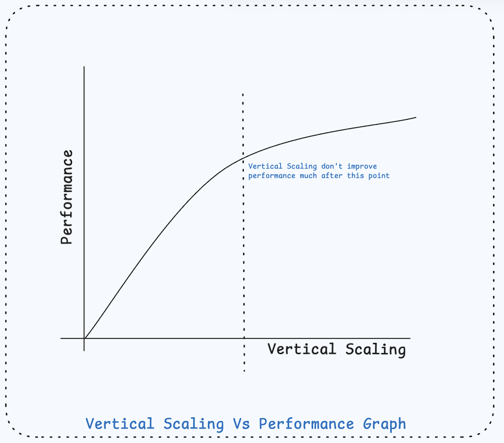

## Types of Scalability
- Vertical Scaling
- Horizontal Scaling

## Vertical Scaling
Vertical scaling is a technique of increasing hardware or configuration of system. For example, initially system is of 500 GB and load or user gets increased. So we increase the storage by extra 500 GB totalling into 1000 GB, it is called as vertical scaling. Increasing specification or configuration of same system, is vertical scaling.
Vertical Scaling is also called sometimes as "scale up".

When traffic is low, vertical scaling can be a great option and the simplicity is one of its main advantage.

### Limitation to Vertical Scaling
- Vertical scaling has a hard limit. It is impossible to add unlimited CPU and memory to a single server.
- It can lead to SPOF (single point of failure) and all the resources that was added can be wasted. So it does not have failover and redundancy.
- Vertical Scaling after a point become very expensive. Performance don't improve after certain point of scaling and adding resources to system becomes expensive and can lead to loss of company.

## Horizontal Scaling
When load increases for a system to an extent, such that the single machine cannot handle all the request properly, we take a route/help of extra systems/machines to handle the upcoming requests. This is called horizontal scale i.e adding more machines/systems.
Here we do not add the hardware to same machine, instead, we add the machines.
Horizontal Scaling is also called sometimes as "scale out".

**2 Salient features of Horizontal Scaling**:
- The machines in cluster is connected over network.
- The extra machines are not very expensive and called as **commodity hardwares** which are usually very cheap.

There is majorly 2 work of the system. Computation and Storage. So we can easily do horizontal scaling.

**Question:** We know monolithic has only one system(machine) included so we can apply horizontal scaling to monolithic systems? As we are increasing the number of machine so the answer is YES.
So the request can hit to any available machine and after the horizontal scaling of the system. It behaves like a distributed system.

### Limitation and Challenges of horizontal scaling
- The first challenge is maintaining consistency and data replication.
- Second challenge is no selective scaling. That is, for example, we want to scale only backend and not front-end and data layer. Then also since it is a monolithic system and all three layers are tightly coupled we have to scale front-end and data layer unnecessarily and that is totally waste.
- Both vertical and horizontal scaling is possible with monolithic systems.

> **If many users access the same web server simultaneously and it reaches the web server's load limit, users generally experience slower responses or fails to connect to server sometimes. In this scenario, Load Balancer is the way out.**
